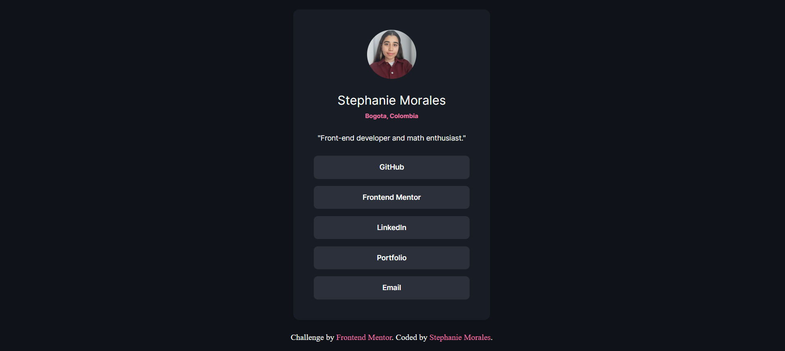

# Frontend Mentor - Social links profile solution

This is a solution to the [Social links profile challenge on Frontend Mentor](https://www.frontendmentor.io/challenges/social-links-profile-UG32l9m6dQ). Frontend Mentor challenges help you improve your coding skills by building realistic projects. 

## Table of contents

- [Overview](#overview)
  - [The challenge](#the-challenge)
  - [Screenshot](#screenshot)
  - [Links](#links)
- [My process](#my-process)
  - [Built with](#built-with)
  - [What I learned](#what-i-learned)
  - [Continued development](#continued-development)
  - [Useful resources](#useful-resources)
- [Author](#author)

## Overview

## The challenge

My challenge was to build a social links profile page and make it look as close as possible to the provided design. I personalized it with my own information and a custom color palette.

### Screenshot



### Links

- [Solution URL](https://github.com/smmu94/social-links-profile-main)
- [Live Site URL ](https://smmu94.github.io/social-links-profile-main/)

## My process

### Built with

- Semantic HTML5 markup  
- CSS custom properties (variables)  
- Flexbox  
- Mobile-first workflow  
- BEM naming

### What I learned

My main takeaway from this project was a better understanding of using CSS custom properties (variables) to manage a consistent color palette across the entire project. This made it much easier to change colors globally and maintain a clean, organized stylesheet.

**Typography example with clamp**

```css
:root {
  /* Colors */
  --dark-blue-900: hsl(220, 25%, 8%);
  --pink: hsla(337, 76%, 70%, 1);
  /* ... more variables */
}

body {
  background-color: var(--dark-blue-900);
}

.card__links a:hover {
  background-color: var(--pink);
}
```

### Continued Development

- Keep practicing with a mobile-first workflow to ensure my designs are responsive and scalable from the start.
- Continue exploring the use of custom properties for other elements, such as typography and spacing, to create more maintainable stylesheets.

### Useful resources  

- [MDN - Using CSS custom properties](https://developer.mozilla.org/en-US/docs/Web/CSS/CSS_cascading_variables/Using_CSS_custom_properties)
- [A Complete Guide to Flexbox](https://css-tricks.com/snippets/css/a-guide-to-flexbox/)  

## Author  

- Frontend Mentor – [@smmu94](https://www.frontendmentor.io/profile/smmu94)  
- GitHub – [@smmu94](https://github.com/smmu94)  
